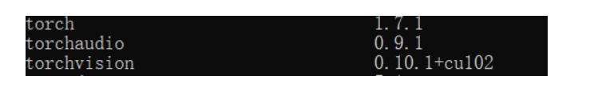

## pycocotool安装
pip install pycocotools-windows -i http://pypi.douban.com/simple/  --trusted-host pypi.douban.com
## unbuntu torch安装
pip install torch==1.7.1+cu110 torchvision==0.8.2+cu110 torchaudio==0.7.2 -f https://download.pytorch.org/whl/torch_stable.html
## 参照
https://github.com/WZMIAOMIAO/deep-learning-for-image-processing/tree/master/pytorch_object_detection/ssd
## ssd环境

## 只读权限
切换到root用户然后
chmod -R 777 ssd